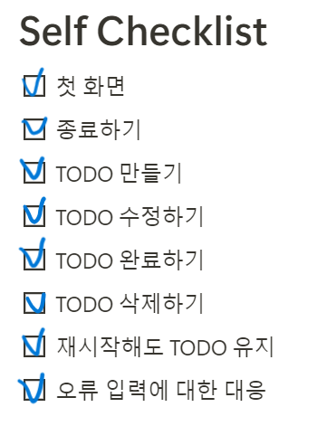

# Ktech-java-project-1


## 실행

### 준비
1. Create [Main](src/project/Main.java) class for running output
2. Create class [ToDoList](src/project/Main.java) for object *list* (containing all tasks) 
3. Create a file [project.csv](src/project/project.csv) to write data
4. Create class [ToDoInputNumber](src/project/ToDoInputNumber.java) for catch error of input number.

### 방식

#### [ToDoList](src/project/Main.java) Class

- Declare 2 variables *String title, String deadline*.
- Initialize the *constructor*, *setter* and *getter*.

#### [ToDoInputNumber](src/project/ToDoInputNumber.java) Class

- Declare variable *int number*.
- Initialize the constructor:
    - Constructor is created with 2 parameters *(String str, int limit)*
    - Using *try-catch* to convert string to number.
        - Catch: **Number Format Exception**
        - Try: using condition if input number exceeds *limit* value, the result would be print out *the advice of valid number*
      
- Initialize the setter and getter.

#### [Main](src/project/Main.java) Class

##### **List<ToDoList> bufferedReader()** method

   - Read file [project.csv](src/project/project.csv)
   - Return to *List<ToDoList>* type

##### **Void bufferedWriter(List<ToDoList> list)** method
   - Write into a file [project.csv](src/project/project.csv)

##### **Main** method  
1. Declare *List<ToDoList> list* from method **bufferedReader()**
2. Run the loop **while (true)**

   *Input* display:

    > ```java
    > Welcome!
    >
    > You have no more TODOs left!!!
    >
    > 1. Create TODO
    > 2. Edit TODO
    > 3. Finish TODO
    > 4. Delete TODO
    > 5. Exit
    >
    > Input: 
    > ```

- Declare variable *input* from class *ToDoInputNumber* to automatically catch Exception without using try-catch in this Main.
```java
String inputString = reader.readLine();
ToDoInputNumber inputNumber = new ToDoInputNumber(inputString, 5);
int input = inputNumber.getNumber();
```
    
- Using condition for *input* variable from 1 to 5 to run the system.

    - **1. Create TODO** (*input*=1):
        - Input *title, deadline*
        - Add into *list* with try-catch for **valid format of date**.
    - **2. Edit TODO** (*input*=2): 
      - Declare variable *editNumber* from class *ToDoInputNumber* to automatically catch *Exception* without using try-catch in this Main.
        >```java
        >Input: 2
        >Edit TODO number: 
        >```
      - Using condition for *editNumber*:
        - if editNumber in the range of number of tasks in list
          - Input *title, deadline*
          - Add into *list* with try-catch for **valid format of date**.
        - else: skip
    - **3. Finish TODO** (*input*=3):
        - Declare *int finishNumber* like *editNumber*.
        - Using condition for *finishNumber* like *editNumber*.
            - *getTitle* from task of list and add *String* **" (Done)"** 
    - **4. Delete TODO** (*input*=4): (like ***3. Finish TODO***)
    - **5. Exit** (*input*=5): `break;`

- ***Notice:*** When print output:
  1. Using condition to count the task not **(Done)** and print ```String.format(
  "You have %d TODOs left!!!", count)```
  2. Using **stream** to sort *list* according to order of the deadline and print output.

3. Out of loop **while (true)**
    - Write into a file [project.csv](src/project/project.csv) by using method *bufferedWriter(list)*.
   

## 기술

- Using **IntelliJ** app to create project
- Using java 8.0

## 고민했던 내용

- *Main* 클래스 아직 까끔하게 정리되지 못한다.
- 어떻게 정당히 나눌 수 있는지 잘 모른다.
- *ToDoList* 어떻게 날짜의 순서로 나올 수 있는지 고민했다.

## 완수한 요구사항

- 모두 완료

